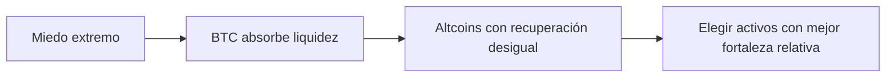

# Criptomonedas 2026: cómo leer el miedo extremo sin comprar por impulso

El mercado cripto entra en 2026 con una paradoja muy conocida: cuando el sentimiento se rompe, aparecen oportunidades… pero también trampas. Con el índice **Fear & Greed en 21**, el mensaje no es “compra todo”, sino **filtra mejor**. En un entorno así, elegir las mejores criptomonedas para invertir en 2026 depende menos de la emoción y más de tres cosas: **dominancia de Bitcoin, fortaleza relativa de las altcoins y liquidez real**.

## 1) Miedo extremo no significa mercado muerto

Un nivel de miedo extremo suele empujar a muchos inversores a vender demasiado pronto o a entrar sin plan. Eso es un error clásico. El dato clave aquí es que el mercado no está colapsado: está **descontando riesgo con fuerza**.

Bitcoin sigue por encima de **US$74.400**, una zona que para muchos minoristas parece “cara”, pero que en realidad puede seguir marcando el tono del ciclo. En cripto, el precio aislado importa menos que la capacidad del activo para atraer capital, sostener narrativa y dominar el flujo de mercado.

Además, la capitalización total del mercado ronda los **US$2,60 billones**, así que no hablamos de un nicho pequeño ni de un entorno sin profundidad. Hablamos de un mercado grande, pero todavía muy sensible a cambios de humor.

**Idea práctica:** en fases de miedo extremo, la pregunta correcta no es “¿qué moneda va a explotar mañana?”, sino “¿qué activo aguanta mejor si el mercado tarda en recuperarse?”.

## 2) Bitcoin sigue mandando, y eso cambia la lectura de las altcoins

La **dominancia de Bitcoin está cerca del 57,3%**, una cifra que pesa mucho en cualquier estrategia. Cuando BTC concentra tanta atención, muchas altcoins pueden parecer baratas, pero tardan más en reaccionar. No todas están rotas; simplemente, algunas necesitan que Bitcoin estabilice primero el mercado.

La foto táctica actual deja una diferencia clara:

- **BTC:** -0,1% en 24h, +4,1% en 7 días, +2,2% en 30 días
- **ETH:** -1,6% en 24h, +4,2% en 7 días, +6,6% en 30 días
- **BNB:** plano en el día, pero con -8,9% en 30 días
- **XRP:** -0,7% en 24h y -6,2% en 30 días

Esto sugiere algo importante: **no todas las caídas significan la misma cosa**. Bitcoin mantiene liderazgo defensivo, Ethereum muestra mejor recuperación relativa y otras altcoins todavía no confirman una vuelta sólida.

## 3) La mejor estrategia no es adivinar el piso, sino escalonar

En mercados nerviosos, intentar acertar el mínimo suele salir caro. Una forma más sensata de abordar la inversión en criptomonedas 2026 es **dividir entradas** en varias compras y reservar una parte en **stablecoins** para mantener flexibilidad.

Esto es especialmente útil para inversores de Latinoamérica, donde muchas veces se combina ahorro en moneda local, búsqueda de cobertura en dólar y uso de cripto para preservar valor. En ese contexto, Bitcoin sigue siendo el activo más líquido del tablero, con un volumen diario cercano a **US$54.700 millones**. Esa profundidad reduce el riesgo de quedar atrapado en movimientos bruscos o spreads incómodos.

La lógica es simple:

- **Bitcoin** para exposición más sólida y líquida.
- **Ethereum** para una apuesta con mejor tracción relativa.
- **Altcoins** solo con tamaño controlado y tesis clara.

Si el mercado sigue dominado por el miedo, la disciplina vale más que la velocidad.

## Conclusión rápida

En 2026, invertir bien en cripto no significa perseguir la moneda de moda. Significa leer el contexto: **miedo extremo, dominancia de Bitcoin y fortaleza relativa de cada activo**. Si esas tres piezas no encajan, el riesgo de comprar ruido es alto.

**Want the full analysis?** [Read the complete guide here](https://coin-track24.com/es/articles/mejores-criptomonedas-para-invertir-en-2026-guia-miedo-extremo)
