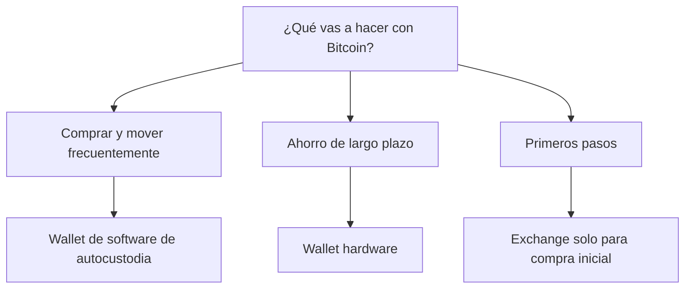

Bitcoin está en una zona donde muchos miran el precio y pocos miran la custodia. Y ahí está el error: cuando el mercado se mueve, la urgencia por comprar o transferir suele superar a la prudencia. Al 18 de abril de 2026, BTC ronda los **US$76.755**, mientras el índice de miedo y codicia se mantiene en **26** (miedo). Esa mezcla suele empujar a usuarios nuevos y veteranos a dejar fondos donde no deberían, confiar en enlaces dudosos o subestimar el valor real de una buena **wallet de bitcoin**.

## 1) La pregunta importante no es “qué app usar”, sino “quién tiene las claves”

En Bitcoin, la custodia define el nivel de control. Si un exchange guarda tus claves, tú dependes de su infraestructura, sus políticas y sus tiempos de retiro. Si tú controlas las claves, tienes una relación mucho más directa con tus fondos. Esa diferencia parece técnica, pero en la práctica cambia todo: acceso, recuperación y exposición a terceros.

Por eso conviene pensar la decisión como un mapa de riesgo, no como una competencia de marcas. La opción correcta depende de tu objetivo:

- **Exchange**: útil para comprar y vender rápido, pero no ideal para guardar saldos importantes por tiempo indefinido.
- **Wallet de software**: buena para uso frecuente, montos moderados y autocustodia bitcoin con más flexibilidad.
- **Wallet hardware**: la favorita para ahorro de largo plazo, porque eleva la seguridad en wallets al aislar mejor las claves.

El punto clave es este: una wallet no es solo una interfaz bonita. Es el sistema que determina si realmente controlas tu dinero o solo tienes acceso temporal.

## 2) El contexto del mercado hace que la seguridad pese más

Bitcoin no está moviéndose en vacío. En los últimos datos disponibles, el activo subió **1,3% en 24 horas**, **5,5% en 7 días** y **8,8% en 30 días**. Ese tipo de comportamiento suele aumentar la actividad: más compras, más transferencias y más oportunidades para cometer errores operativos.

Además, el mercado cripto en conjunto ya supera los **US$2,69 billones**, y BTC conserva cerca de **57,3% de dominancia**. Eso significa que cualquier problema de custodia en Bitcoin no es marginal: afecta a la parte más relevante del mercado.

En entornos así, los riesgos más comunes no son “fallas de la blockchain”, sino errores humanos:

- descargar una app falsa,
- no guardar bien la frase semilla,
- depender de soporte falso,
- o dejar fondos en una plataforma por comodidad.

La lección es simple: cuando el mercado cripto se acelera, la disciplina importa más que la velocidad.

## 3) Qué elegir según tu perfil

Si tu uso es **táctico o semanal**, una wallet de software de autocustodia puede ser suficiente, siempre que la instales desde la fuente oficial y pruebes el backup antes de mover montos serios.

Si tu idea es **ahorrar a mediano o largo plazo**, una **wallet hardware** comprada al fabricante o a un distribuidor verificado suele ser la opción más sólida. En ese caso, lo ideal es separar:

- una wallet para gasto diario,
- y otra para reserva de valor.

Si eres **principiante absoluto**, empezar en un exchange puede servir solo como paso inicial para comprar. Pero dejar ahí el saldo como si fuera una caja fuerte no es la mejor estrategia cuando el monto ya representa una parte importante de tu patrimonio.

## En resumen

La mejor **wallet de bitcoin** no es la más popular ni la más cómoda: es la que mejor encaja con tu nivel de riesgo, tu frecuencia de uso y tu capacidad de manejar backups sin improvisar. En un mercado donde BTC cotiza cerca de **US$76.755** y el sentimiento sigue en miedo, reducir la superficie de ataque vale más que perseguir la app de moda.

**Want the full analysis?** Read the complete article here: https://coin-track24.com/es/articles/wallets-de-bitcoin-como-elegir-la-mejor-en-2026
