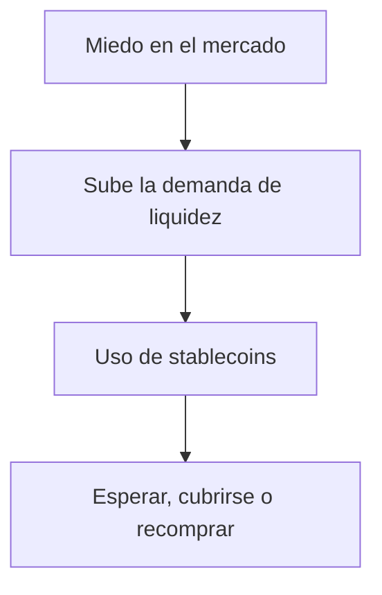

# Stablecoins en miedo: por qué vuelven a ser el centro de atención

Cuando el mercado entra en modo defensivo, no todos buscan “la próxima gran subida”. Muchos prefieren algo mucho más simple: **proteger valor sin salir del ecosistema cripto**. Ahí es donde las **stablecoins** vuelven a ganar protagonismo. Con el índice de miedo y codicia en **27** —zona de miedo—, guardar parte del portafolio en dólares digitales deja de parecer una jugada conservadora y pasa a ser una estrategia práctica.

En un contexto donde **Bitcoin ronda los US$75.244** y **Ethereum se mueve cerca de US$2.319**, la pregunta no siempre es “qué comprar”, sino **cuándo esperar**. Para quienes operan entre exchanges, wallets y protocolos DeFi, una stablecoin funciona como una pausa táctica: no te saca del mercado, pero sí te da margen para reaccionar rápido.

## 1) Qué son las stablecoins en la práctica

Una stablecoin es un activo digital diseñado para mantenerse cerca de un valor fijo, normalmente el dólar. No significa que sea inmune a movimientos, sino que su variación suele ser mucho menor que la de BTC, ETH o las altcoins más volátiles.

Ese detalle importa porque muchas personas las confunden con “dinero sin riesgo”. No lo son. Tienen riesgos de emisor, de custodia, de red y también de plataforma. Aun así, cumplen una función clave: **reducir la volatilidad sin abandonar la infraestructura cripto**.

En América Latina esa utilidad se nota todavía más. Cambiar a moneda local puede implicar demoras, spreads altos o fricción bancaria. En cambio, mover valor en stablecoins permite operar con más velocidad entre países, exchanges y aplicaciones financieras.

## 2) USDT y USDC: dos opciones que dominan la conversación

Si hablamos de liquidez, **USDT** sigue siendo la referencia más usada por volumen y presencia en el mercado. Su atractivo es simple: está en casi todas partes y suele ser el puente más rápido para entrar o salir de posiciones.

**USDC**, por su parte, se presenta como una alternativa muy extendida con foco en transparencia y estructura regulada. En la práctica, ambos buscan lo mismo: mantener la paridad con el dólar y ofrecer estabilidad operativa.

La diferencia se ve mejor cuando el mercado corrige. En la última jornada disponible, **Bitcoin cayó 1,9684%**, **Ethereum retrocedió 2,6074%**, mientras **USDT apenas se movió 0,0064%** y **USDC avanzó 0,0013%**. Esa brecha es la razón por la que muchos traders y usuarios las usan como “estacionamiento” temporal.

No son activos para multiplicar capital de forma agresiva. Son herramientas para **conservar poder de compra**, esperar una mejor entrada o mover fondos sin quedarte expuesto a la volatilidad del momento.

## 3) La función más útil: liquidez inmediata

Más allá de la teoría, la gran ventaja de las stablecoins es la **liquidez en cripto**. Sirven para:

- salir de una posición sin pasar primero por moneda local,
- mover fondos entre plataformas con rapidez,
- recomprar una caída cuando aparece oportunidad,
- participar en DeFi sin depender del sistema bancario tradicional.

Eso explica por qué siguen siendo tan importantes incluso cuando el mercado total cripto es grande y maduro. No compiten con Bitcoin como reserva de valor a largo plazo; compiten en otra liga: la de la **flexibilidad operativa**.

En otras palabras, cuando el sentimiento se pone feo, las stablecoins no están para prometer ganancias. Están para darte tiempo, liquidez y capacidad de maniobra.

## Cierre rápido

Si operas en cripto, entender **qué son las stablecoins** y cuándo usar **USDT** o **USDC** puede cambiar la forma en que gestionas riesgo. No se trata solo de “estar en dólares”, sino de tener una herramienta que te permita moverte con rapidez cuando todo lo demás cae.

**Want the full analysis?** Read the complete article here: [https://coin-track24.com/es/articles/stablecoins-que-son-como-usarlas-y-cual-elegir-en-miedo](https://coin-track24.com/es/articles/stablecoins-que-son-como-usarlas-y-cual-elegir-en-miedo)
