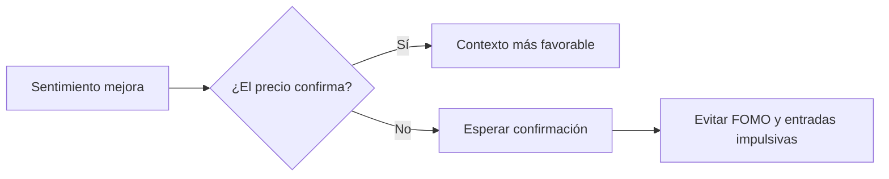

# Miedo, precio y contexto: la combinación que sí ayuda

En cripto, ver rojo en la pantalla no significa automáticamente que la tendencia esté rota. De hecho, el **análisis técnico cripto** funciona mejor cuando se usa para leer contexto, no para adivinar el futuro. Hoy el mercado sigue en zona de miedo, con un **Fear & Greed Index de 29**, pero eso no implica pánico total: a veces solo marca una fase donde conviene observar con más disciplina.

Para un principiante, esta es la idea clave: **el sentimiento del mercado puede mejorar antes que el precio, o al revés**. Si ambos empiezan a alinearse, el escenario cambia. Si no, lo más prudente es esperar confirmación.

## 1) El miedo no es una señal de compra automática

Muchos inversores nuevos ven “miedo” y piensan en oportunidad inmediata. El problema es que el sentimiento, por sí solo, no indica entrada. Solo te dice en qué tipo de clima estás operando.

En la práctica, esto se traduce en tres lecturas útiles:

- **Miedo con caída persistente:** el riesgo sigue dominando.
- **Miedo con recuperación gradual:** puede haber rebote, pero todavía no es momento de ir con todo.
- **Euforia:** suele llegar tarde y castigar rápido a los que compran por impulso.

La mejor forma de usar esta información es simple: combinarla con el comportamiento del precio. Si el mercado mejora en ánimo, pero **Bitcoin precio** y **Ethereum precio** no confirman, la señal sigue incompleta.

## 2) Bitcoin y Ethereum muestran presión corta, pero no rompen la estructura

Los movimientos recientes ayudan a entender por qué conviene mirar más de un marco temporal. **Bitcoin cotiza cerca de US$74.700**, con una variación de **-0,7% en 24 horas**, pero todavía acumula alrededor de **+5,2% en siete días** y **+5,7% en treinta días**. Eso sugiere una corrección corta dentro de un fondo más constructivo.

**Ethereum**, por su parte, ronda los **US$2.294**. Su caída diaria es algo más marcada, cerca de **-1,1%**, aunque mantiene avances de **+4,3% semanal** y **+6,5% mensual**. En otras palabras: hay presión, sí, pero no necesariamente una reversión completa.

Para quienes siguen el **mercado cripto**, esta diferencia entre ruido de corto plazo y estructura de medio plazo es crucial. Un retroceso intradía puede asustar, pero no siempre destruye la tendencia previa.

## 3) La dominancia de Bitcoin sigue siendo una pista útil

Otro punto que vale la pena vigilar es la **dominancia de Bitcoin**. Cuando BTC conserva liderazgo, suele marcar el ritmo del resto del mercado. Si pierde fuerza frente a altcoins, el flujo cambia y la lectura técnica se vuelve más compleja.

Hoy, el dato importante no es solo si sube o baja una vela, sino si Bitcoin mantiene su papel de activo guía. Eso ayuda a medir la **fortaleza relativa** entre Bitcoin y Ethereum, y a decidir si el mercado está entrando en una fase de acumulación, rotación o simple rebote.

Un dato adicional para no perder perspectiva: Bitcoin aún está aproximadamente **40,7% por debajo de su máximo histórico**, mientras Ethereum se ubica cerca de **53,6%** de su ATH. Eso no garantiza subidas, pero sí muestra que el mercado todavía está lejos de niveles de exceso extremo.

## En resumen

Si estás empezando, no intentes usar el miedo como señal mágica. Úsalo como filtro. El verdadero valor del **análisis técnico cripto** está en combinar tres cosas: **sentimiento del mercado**, **estructura del precio** y **liderazgo de Bitcoin y Ethereum**. Esa mezcla ayuda mucho más que perseguir velas o reaccionar tarde a las noticias.

**Want the full analysis?** Read it here: https://coin-track24.com/es/articles/analisis-tecnico-cripto-principiantes-miedo-btc-dominancia
