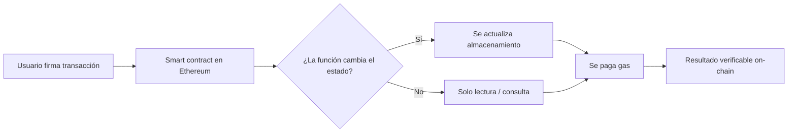

Si alguna vez usaste una dApp y pensaste que solo estabas tocando un botón, probablemente ya interactuaste con un smart contract sin darte cuenta. Esa es la magia de Ethereum: detrás de swaps, préstamos, staking líquido o stablecoins hay código que ejecuta reglas de forma automática. Pero aquí está el matiz importante: automatización no significa seguridad.

## 1) Un smart contract no es una promesa, es código con reglas y estado

Un contrato inteligente vive en la blockchain y responde cuando una transacción válida activa una función. No depende de un servidor central ni de la buena voluntad de una empresa; su ejecución ocurre bajo el consenso de la red. Eso lo vuelve transparente, pero también implacable: si la lógica tiene un error, el error se replica on-chain.

Lo que más suele pasar desapercibido es que estos contratos no solo “hacen cálculos”. También guardan información persistente: balances internos, permisos, límites de retiro, garantías bloqueadas o resultados previos. Ese historial cambia cómo se comporta el contrato en la siguiente interacción.

En DeFi esto es clave. Un protocolo de préstamos no decide si puedes retirar colateral mirando el aire: consulta su estado. Un DEX tampoco calcula un swap como una simple calculadora; usa variables que cambian después de cada operación. Por eso, entender el estado del contrato ayuda a evitar confusiones como creer que un depósito se completó cuando en realidad falló, quedó pendiente o no modificó la condición necesaria para el siguiente paso.

## 2) El costo real no siempre es el precio del activo: también está el gas

Cada acción que modifica almacenamiento consume gas en Ethereum. Y eso importa más de lo que parece. Una interacción barata en apariencia puede terminar siendo costosa si el contrato hace demasiadas escrituras o si la red está congestionada.

Para quien usa Ethereum desde América Latina —ya sea para remesas, dolarización, arbitraje o mover fondos entre exchanges— entender este punto puede ahorrar dinero y frustraciones. No todas las operaciones tienen el mismo costo operativo, y no todas cambian el estado de la misma manera.

Dicho de forma simple: firmar una transacción no es lo mismo que lograr el resultado esperado. El usuario debe revisar si la operación realmente alteró el contrato, si hubo consumo de gas y si la transacción dejó una huella verificable en la cadena.

## 3) Ethereum sigue siendo el laboratorio principal de contratos programables

Ethereum no es solo un activo; es una plataforma donde viven muchas de las piezas más importantes de DeFi. Esa relevancia también explica por qué sigue siendo el lugar ideal para aprender cómo funcionan los contratos inteligentes y dónde aparecen sus riesgos.

Al momento de la consulta, ETH cotizaba cerca de **US$2.319** y acumulaba un avance mensual de **15,6%**. Además, la red rondaba una capitalización de **US$279.800 millones**, una cifra que ayuda a entender por qué sigue siendo el centro de atención para desarrolladores, usuarios y protocolos.

Aun así, el mercado no está en modo euforia: el índice de miedo y codicia se ubicaba en **47**, una lectura neutral. Y aunque Bitcoin mantiene una dominancia de **58,2%**, gran parte de la infraestructura programable que sostiene DeFi sigue aprendiendo primero en Ethereum.

En otras palabras: si vas a usar contratos inteligentes, conviene mirar más allá del precio del token. Hay que leer la lógica, revisar el estado y entender el costo de cada interacción. Eso no elimina el riesgo cripto, pero sí reduce la probabilidad de cometer errores básicos.

**Want the full analysis?** Read the complete article here: [https://coin-track24.com/es/articles/smart-contracts-en-ethereum-como-funcionan-y-riesgos](https://coin-track24.com/es/articles/smart-contracts-en-ethereum-como-funcionan-y-riesgos)
