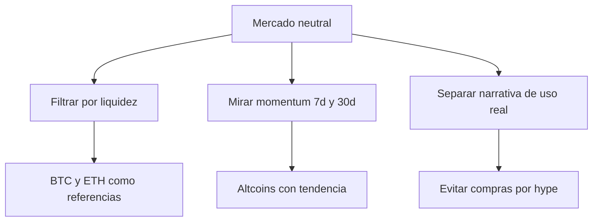

Si estás buscando **mejores criptomonedas 2026**, el primer filtro no debería ser el ruido de X, Telegram o los titulares de moda. Hoy el mercado da una señal bastante clara: no está en pánico, pero tampoco en euforia. El **Crypto Fear & Greed Index está en 48**, una lectura neutral que obliga a ser más selectivo que nunca.

Eso cambia por completo la forma de mirar una **inversión en criptomonedas 2026**. En un entorno sin exceso de optimismo, importa más identificar activos con volumen, uso real y una estructura de mercado sólida que perseguir subidas rápidas sin respaldo.

## 1) El contexto importa más que la narrativa

La lectura neutral del sentimiento sugiere algo importante: el mercado cripto todavía no está en una fase donde “todo sube”. En este tipo de escenario, la diferencia entre acertar y equivocarse suele estar en la calidad del activo, no en la velocidad del hype.

Dos nombres siguen dominando la conversación por razones distintas:

- **Bitcoin**: continúa siendo el activo de referencia del sector, el más cercano a una reserva de valor dentro del ecosistema.
- **Ethereum**: funciona como infraestructura para contratos inteligentes, apps descentralizadas y buena parte de la actividad on-chain.

Para un inversor de LATAM, esta distinción no es menor. Bitcoin suele representar exposición más defensiva al ciclo, mientras que Ethereum depende también del uso de su red y del desarrollo que sostiene su demanda.

## 2) La liquidez separa a los líderes de los activos frágiles

Si quieres filtrar el mercado con datos reales, el volumen pesa tanto como el precio. Un activo con liquidez profunda permite entrar y salir con menos fricción, algo clave cuando se opera desde exchanges regionales o se convierte entre cripto y moneda local.

Algunos datos ayudan a dimensionarlo:

- **USDT** mueve cerca de **US$68.000 millones** en 24 horas.
- **USDC** ronda los **US$12.600 millones** diarios.
- **Bitcoin** negocia alrededor de **US$34.900 millones** al día.
- **Ethereum** se sitúa cerca de **US$21.300 millones** en volumen diario.

Este tipo de cifras no solo muestran tamaño; también indican dónde se estaciona el capital antes de rotar hacia activos con más riesgo. En otras palabras: la liquidez cuenta una parte importante de la historia del mercado cripto.

## 3) No todas las subidas significan fortaleza

En un ranking serio de **mercado cripto**, el rendimiento reciente debe leerse junto con el contexto. Un movimiento fuerte de corto plazo no siempre confirma tendencia. Por eso conviene mirar si el impulso viene acompañado de profundidad y continuidad.

Entre los activos con mejor comportamiento reciente aparecen nombres como **XRP**, **SOL**, **ADA** y **DOGE**, pero eso no significa que todos tengan el mismo perfil. Algunos responden a narrativa, otros a rotación hacia altcoins y otros a expectativas de adopción o actividad de red.

Lo útil aquí no es preguntar “qué coin subió más”, sino:

- ¿Tiene liquidez suficiente?
- ¿Su precio refleja una tendencia real o solo un rebote?
- ¿Se puede comprar y vender con facilidad en mercados accesibles para LATAM?

Esa es la diferencia entre seguir un pico puntual y construir una lectura más sólida sobre **bitcoin precio**, **ethereum** y el resto del tablero.

## Resumen rápido

En este momento, el mercado no está dando una señal de compra impulsiva, sino una invitación a seleccionar mejor. Con sentimiento neutral, volumen alto en los líderes y una rotación activa entre grandes y altcoins, lo más sensato es priorizar activos con datos verificables y no solo con popularidad.

**Want the full analysis?** Read the complete article here: [https://coin-track24.com/es/articles/mejores-criptomonedas-para-invertir-en-2026-guia-con-datos](https://coin-track24.com/es/articles/mejores-criptomonedas-para-invertir-en-2026-guia-con-datos)
