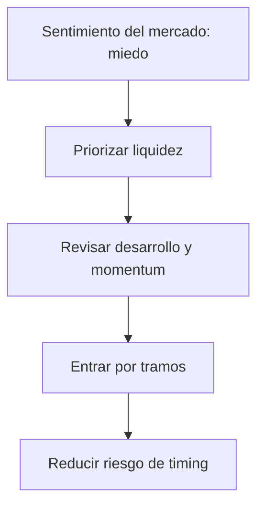

Si estás mirando **mejores criptomonedas para invertir en 2026**, el primer error es empezar por el “precio barato”. En cripto, lo importante no es solo cuánto sube un activo, sino **qué señales está mostrando el mercado hoy**: liquidez, fortaleza relativa y actividad real detrás del proyecto.

Ahora mismo, el contexto no es de euforia. El sentimiento del mercado está en **29**, una zona de miedo que obliga a ser más selectivo. Eso no significa huir, pero sí cambiar la forma de entrar: menos impulso, más método. En otras palabras, la **inversión en criptomonedas 2026** probablemente premiará a quienes compren por tramos y no a quienes persigan velas verdes.

## 1) Bitcoin sigue marcando el ritmo

Aunque el mercado está más amplio que hace unos años, **Bitcoin precio** y dominio siguen siendo la brújula principal. Su participación en el mercado ronda el **58,2%**, una cifra que muestra algo importante: el capital todavía prefiere la liquidez y la seguridad relativa de los activos grandes antes que rotar masivamente hacia apuestas más agresivas.

Eso tiene una lectura práctica. Si Bitcoin concentra el flujo, entonces muchas altcoins pueden tardar más en despegar o hacerlo con más volatilidad. Para un perfil que busca entrar con cabeza fría, BTC sigue funcionando como base defensiva dentro de una cartera cripto.

## 2) Ethereum mantiene la tesis, aunque el precio no acompañe

Ethereum es el caso clásico de proyecto fuerte con mercado exigente. En términos de red e infraestructura, sigue siendo una pieza clave para DeFi, contratos inteligentes y gran parte de la actividad on-chain. Además, su desarrollo no está parado: registró **22 commits en la última semana y 111 en cuatro semanas**.

El problema es que el precio no siempre confirma esa fortaleza técnica de inmediato. En el corto plazo, ETH puede verse presionado, pero eso no borra su papel estructural dentro del ecosistema. Para muchos inversores, esta combinación de utilidad + desarrollo activo es precisamente lo que lo mantiene en la conversación de cara a 2026.

## 3) Liquidez y entradas graduales: el filtro que más importa

En un mercado con miedo, la liquidez vale oro. Bitcoin mueve cerca de **US$28.300 millones en 24 horas** y Ethereum alrededor de **US$11.300 millones**. Esa profundidad reduce fricción al comprar y vender, algo clave si operas desde exchanges regionales o si usas **stablecoins** como caja táctica.

Por eso, una buena estrategia no suele ser “todo o nada”, sino una **estrategia de entrada por tramos**. Comprar en varias etapas ayuda a manejar la volatilidad y evita quedar atrapado en un mal punto de entrada.

Una forma simple de leer el mercado sería esta:

## En resumen

Para 2026, la clave no es perseguir la moneda más ruidosa, sino identificar **señales de fortaleza cripto**: dominio, liquidez, actividad técnica y una narrativa que todavía tenga soporte real. Hoy, eso pone a **Bitcoin** y **Ethereum** en el centro del radar, mientras que las stablecoins siguen siendo útiles como reserva temporal para esperar mejores puntos de entrada.

Si quieres ver cómo se comparan otros activos y qué lectura completa sale de la matriz de señales, sigue con el análisis detallado.

**Want the full analysis?** [Read the full article here](https://coin-track24.com/es/articles/mejores-criptomonedas-para-invertir-en-2026-senales)
